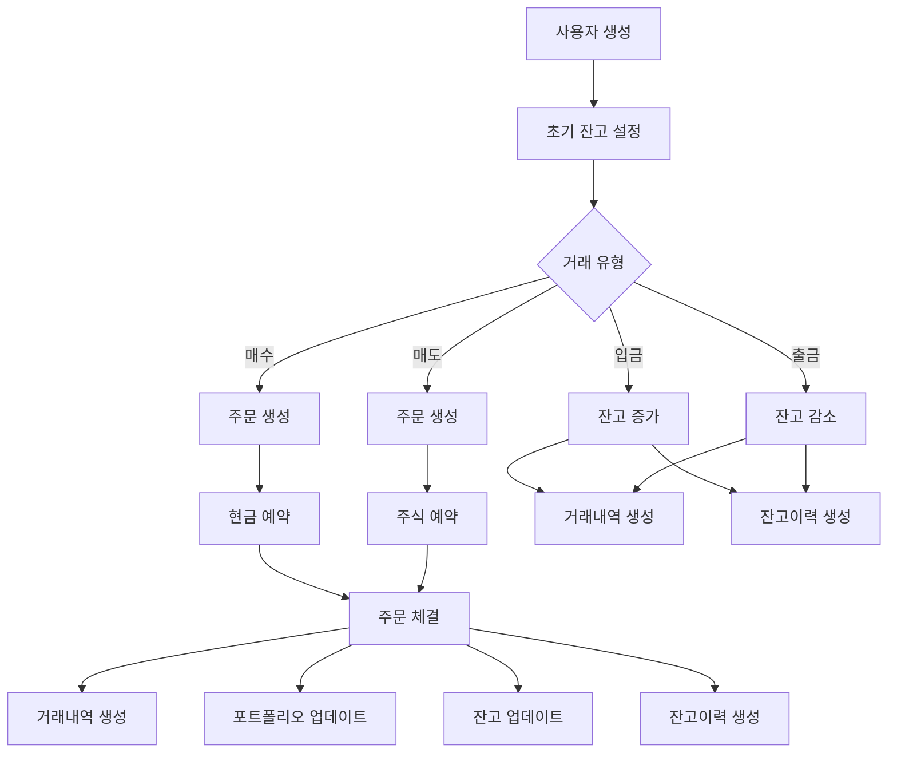

# 거래 시스템 테스트 요약

이 문서는 거래 시스템의 주요 모델들에 대한 테스트 케이스를 요약합니다.

## 테스트 파일 구조

### 1. `test_trading_complete_flow.py` ⭐ 핵심 테스트
주요 모델들의 상호작용을 종합적으로 테스트합니다.

#### 입금/출금 테스트
- ✅ 입금 시 잔고(virtual_balance) 업데이트
- ✅ 출금 시 잔고 검증 및 업데이트
- ✅ 거래 내역(transactions) 생성 확인
- ✅ 잔고 이력(virtual_balance_histories) 기록

#### 매수/매도 플로우 테스트
- ✅ 주문(orders) 생성 및 상태 변경
- ✅ 잔고 예약 및 해제
- ✅ 포트폴리오(portfolios) 생성 및 업데이트
- ✅ 평균 단가 계산
- ✅ 실현 손익 계산
- ✅ 거래 내역 및 잔고 이력 생성

#### 복잡한 시나리오 테스트
- ✅ 여러 번 매수 시 평균 단가 계산
- ✅ 전량 매도 후 재매수
- ✅ 동시 주문 시 현금/주식 예약 관리
- ✅ 전체 잔고 이력 추적 및 연속성 검증

### 2. `test_trading_with_fees_and_stats.py` 💰 수수료/세금 및 통계
수수료, 세금, 거래 통계를 중점적으로 테스트합니다.

#### 수수료/세금 처리
- ✅ 매수 시 수수료 처리
- ✅ 매도 시 수수료 + 세금 처리
- ✅ 여러 거래의 수수료/세금 누적
- ✅ 순 거래금액 계산 검증

#### 거래 통계
- ✅ 일별 거래 통계(TradingStatistics) 생성
- ✅ 월별 거래 요약
- ✅ 포트폴리오 성과 지표
- ✅ 필터를 활용한 거래 내역 조회

#### 잔고 이력 추적
- ✅ 모든 거래 유형별 이력 생성
- ✅ 잔고 연속성 검증
- ✅ 최종 잔고와 이력의 일치성

### 3. `test_trading_edge_cases.py` 🚨 엣지 케이스 및 에러
예외 상황과 에러 처리를 테스트합니다.

#### 잔고 부족 시나리오
- ✅ 매수 시 잔고 부족
- ✅ 출금 시 잔고 부족
- ✅ 복수 주문으로 인한 잔고 부족

#### 초과 매도 방지
- ✅ 보유 수량 초과 매도 차단
- ✅ 미보유 종목 매도 차단

#### 검증 및 예외 처리
- ✅ 음수 금액/수량 검증
- ✅ 주문 취소 시나리오
- ✅ 부분 체결 처리
- ✅ 동시성 문제 방지
- ✅ 소수점 정밀도 처리
- ✅ 트랜잭션 롤백
- ✅ 0원 거래 방지

## 테스트 대상 모델 및 테이블

### 1. **orders** (주문)
- 주문 생성, 상태 변경 (PENDING → COMPLETED/CANCELLED)
- 체결 정보 업데이트
- 수수료/세금 기록

### 2. **transactions** (거래내역)
- 매수/매도/입금/출금 거래 생성
- 거래 전후 잔고 스냅샷
- 수수료/세금/순거래금액 계산

### 3. **portfolios** (보유주식)
- 포트폴리오 생성 및 업데이트
- 평균 단가 계산
- 실현 손익 추적
- 보유 수량 관리

### 4. **virtual_balances** (잔고)
- 현금 잔고 및 가용 현금 관리
- 투자 금액 추적
- 총 매수/매도 금액 누적
- 수수료/세금 누적

### 5. **virtual_balance_histories** (잔고이력)
- 모든 잔고 변동 기록
- 변경 유형별 이력 (BUY/SELL/DEPOSIT/WITHDRAW)
- 변경 전후 잔고 추적
- 관련 주문 연결

## 테스트 실행 방법

```bash

uv run pytest -v

# 모든 거래 관련 테스트 실행
python tests/run_trading_tests.py

# 특정 테스트 파일만 실행
python tests/run_trading_tests.py --file test_trading_complete_flow.py

# 상세 출력과 함께 실행
python tests/run_trading_tests.py --verbose

# pytest 직접 실행
pytest tests/test_trading_complete_flow.py -v
```

## 주요 테스트 시나리오 흐름



## 테스트 커버리지

- ✅ **정상 플로우**: 입금 → 매수 → 매도 → 출금
- ✅ **복잡한 시나리오**: 부분 체결, 평균가 계산, 실현손익
- ✅ **에러 처리**: 잔고 부족, 초과 매도, 검증 실패
- ✅ **데이터 일관성**: 잔고 연속성, 트랜잭션 원자성
- ✅ **성능 지표**: 거래 통계, 포트폴리오 수익률

이 테스트들은 거래 시스템의 핵심 기능들이 정확하게 동작하고, 
데이터 무결성이 유지되며, 예외 상황이 적절히 처리됨을 보장합니다.
